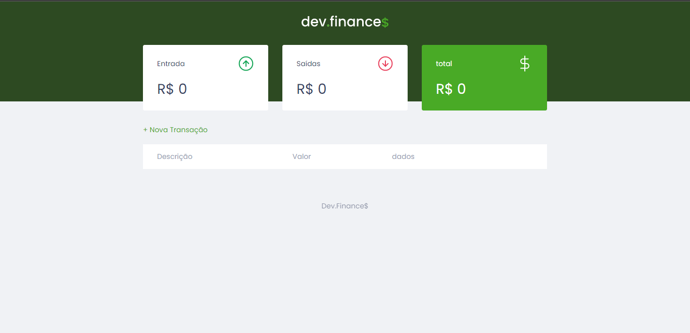
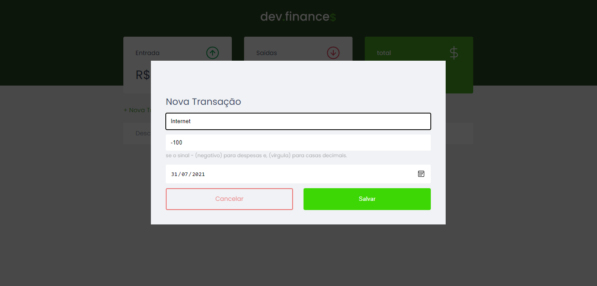
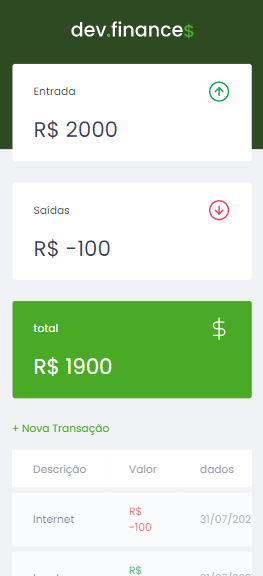

# :dollar: DevFinance :computer:

Este projeto foi refeito a partir das aulas da equipe do Rocketseat Discover Marathon.
A principal diferença está na tecnologia utilizada, já que o projeto é baseado no pacote básico (HTML, CSS e JS), o meu é formado com React Js.

## Breve descrição:

Este projeto se concentra em ajudar os programadores com sua situação financeira, onde ele faz o cálculo "econômico" do dinheiro que entra e sai. Além disso, apresenta uma tabela que contém informações sobre despesas e receitas (Descrição, Valor e Data).

Para adicionar elementos à tabela é necessário clicar no botão "+ Nova transação" para abrir a guia de adição.

Outro ponto deste projeto é a sua capacidade de responsividade representada pela imagem abaixo.

A próxima imagem contém a tabela com elementos já posicionados.